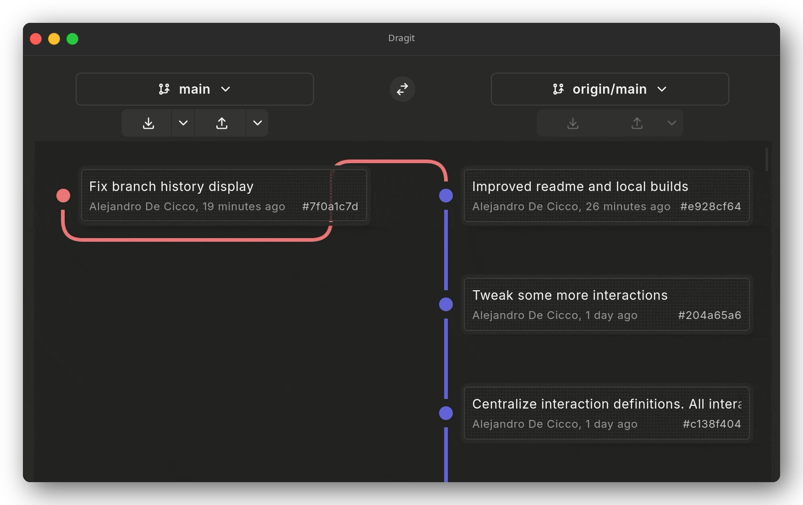
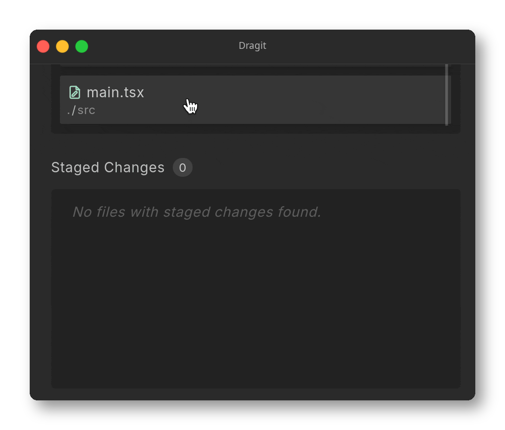
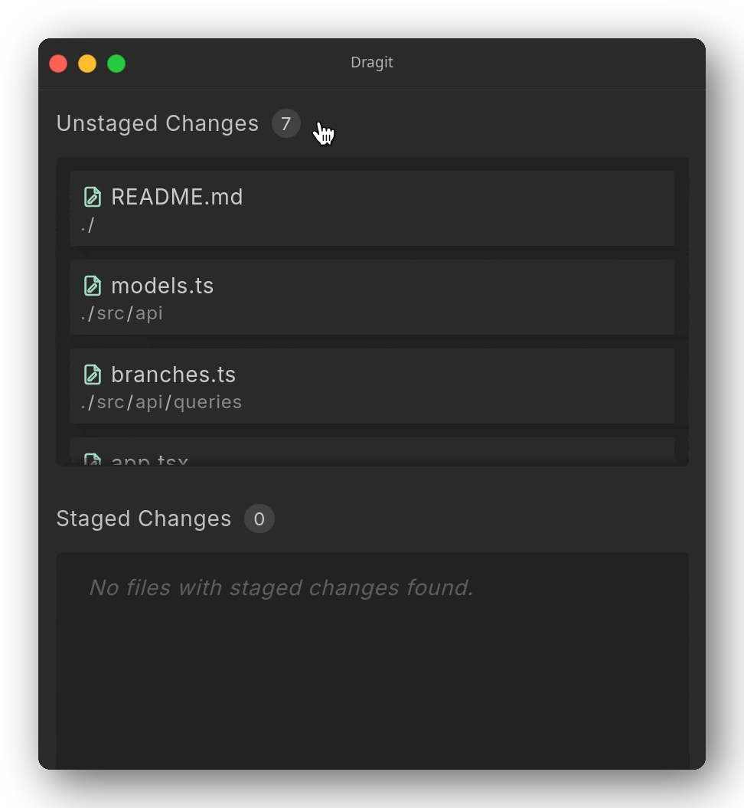
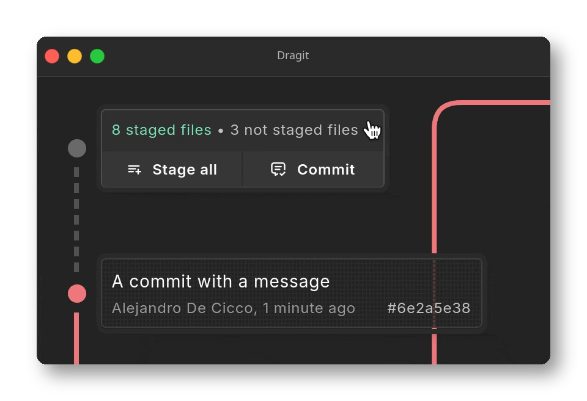
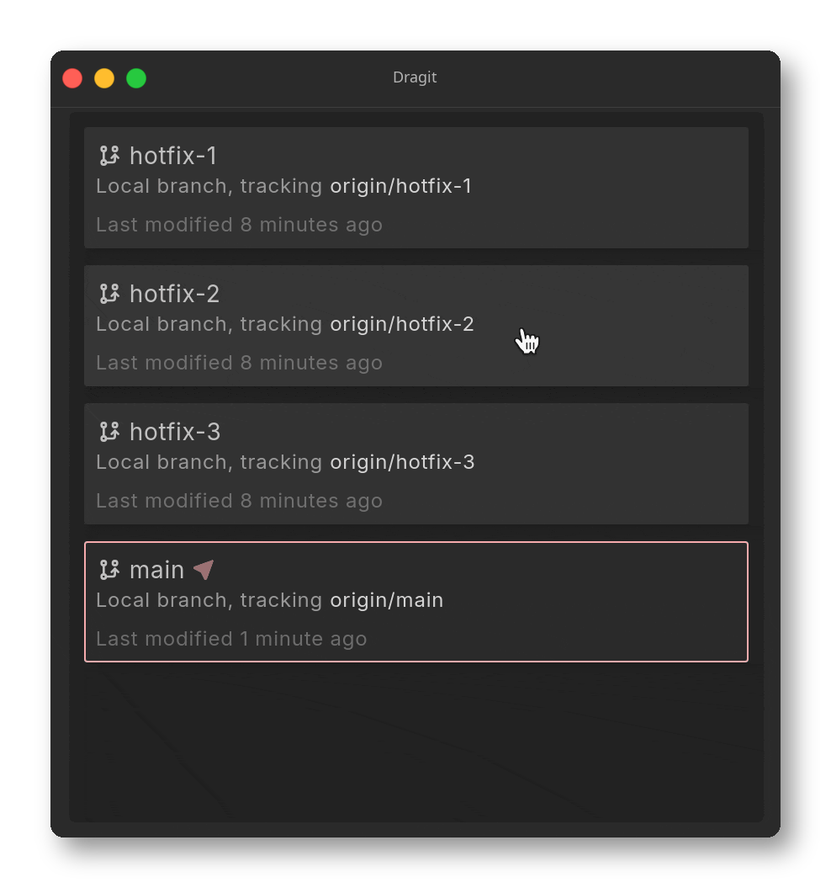
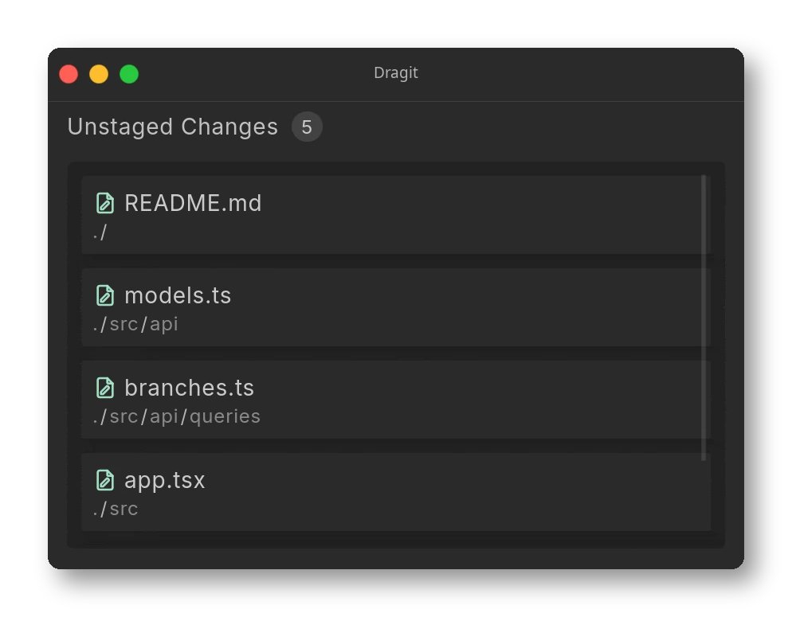
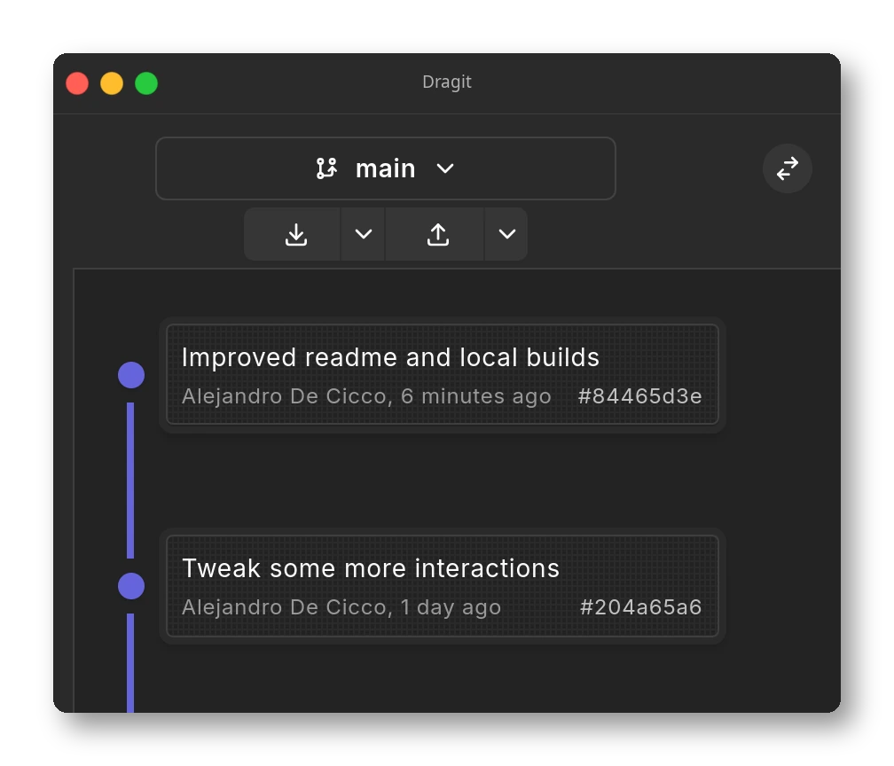
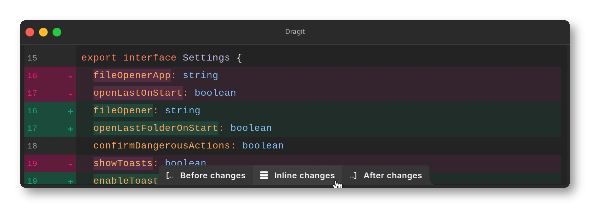

  

  ## Dragit

  A modern and convenient Git client. 

  Branch, merge, checkout, stage, all by dragging and dropping or hitting a hotkey.

  
  

  

 

## Motivation

The goal of this project is to make a Git client that looks great and allows performing all the daily tasks of version control with a simplified flow. Git's complexity is abstracted away, but all of its power is still there. So you get a streamlined experience where any action can be performed right away with a gesture, a hotkey, or a few clicks, with all the necessary information displayed at all times on a single screen.

## Features

Don't want to type? Everything can be done with a drag-and-drop gesture.

Like using the keyboard? Hotkeys and command palettes allow you to go through the workflow without having to reach for the mouse.

Here are a few:

 

    
    
Stage or unstage a file

 

    
    
Or all of them at once

 

    
    
Amend that last commit if you made a mistake

 

    
    
Drag old branches that are lying around to the recycling bin

 

    
    
Open context menus for a more detailed list of all actions available

 

    
    
Or use keyboard shortcuts to go faster

 

    
    
Check your changes with the integrated word-level diff viewer, complete with syntax highlighting for all languages (including unmerged conflicts)

## Installation

Download the latest release for your platform from the [Releases page](https://github.com/aledecicco/dragit/releases). Installers are provided for macOS, Windows, and Linux.

The app includes a built-in auto-updater, so future updates install automatically once you're on a release build.

Git must be installed and available on the `PATH` as the `git` command. Version `2.51.0` or later is recommended.

### Building from source

If you'd rather build it yourself, you can use the [`just`](https://github.com/casey/just) command `just build`. Building requires Node.js, Rust, and the [Tauri prerequisites](https://tauri.app/start/prerequisites/) for your OS.

Linux builds also use [`Docker`](https://docs.docker.com/get-docker) to run inside a container and avoid cross-platform issues.

After the build, you'll find the compiled binaries in the `src-tauri/target/release/bundle` directory.

There's also a convenience command for Arch users that uses the binaries produced by the build and installs the app: `just build-aur`.

## Tech Stack

Dragit is built with Tauri v2. A React/TypeScript frontend runs in a WebView, while a Rust backend handles all Git logic, file watching, and OS integration.

| Layer                   | Technologies            |
|-------------------------|-------------------------|
| **Desktop shell**       | Tauri v2                |
| **Frontend**            | TypeScript, React 19.2  |
| **Backend**             | Rust                    |
| **Git backend**         | Git CLI                 |
| **Diff engine**         | imara-diff              |
| **Serialization**       | Borsh                   |
| **File watcher**        | notify                  |
| **Build tool**          | Vite                    |
| **Styling**             | Tailwind CSS v4         |
| **Virtualization**      | TanStack Virtual        |
| **Client state**        | Zustand, TanStack Query |
| **Drag and drop**       | dnd-kit                 |
| **Syntax highlighting** | starry-night            |
| **UI primitives**       | Ariakit                 |
| **Toasts**              | Sonner                  |
| **Linter / formatter**  | Biome                   |

## Roadmap

There's always things to improve:

- [ ] Replace `CmdGit` with a native Rust Git backend (removes the system `git` dependency)
- [ ] Highlight changed file sections in the diff scrollbar
- [x] Compare arbitrary refspecs side-by-side
- [ ] Show merge unions between branches
- [ ] Clone and open a repository from a URL
- [ ] Animations
- [ ] Allow layout adjustments
- [ ] Manage remote tags
- [ ] Resolve individual diff hunks directly in the diff viewer
